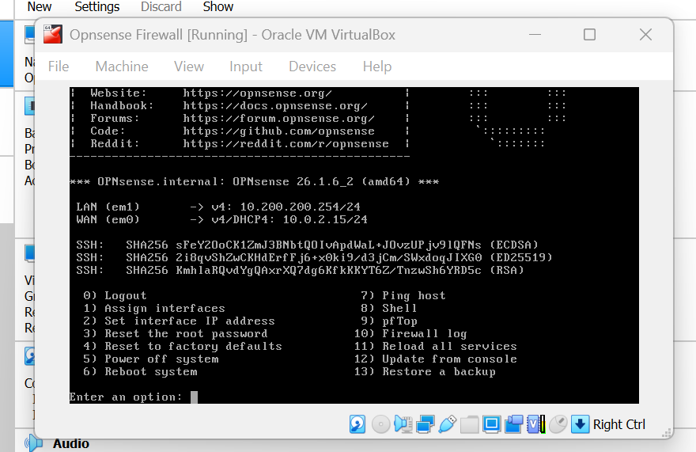
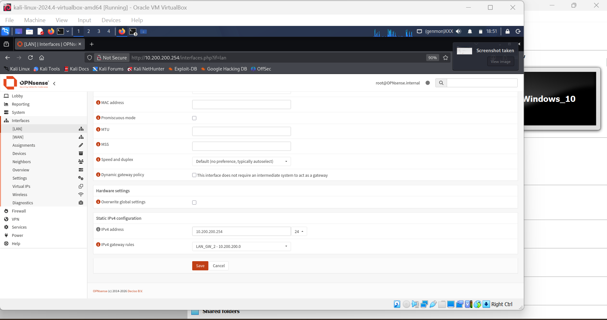
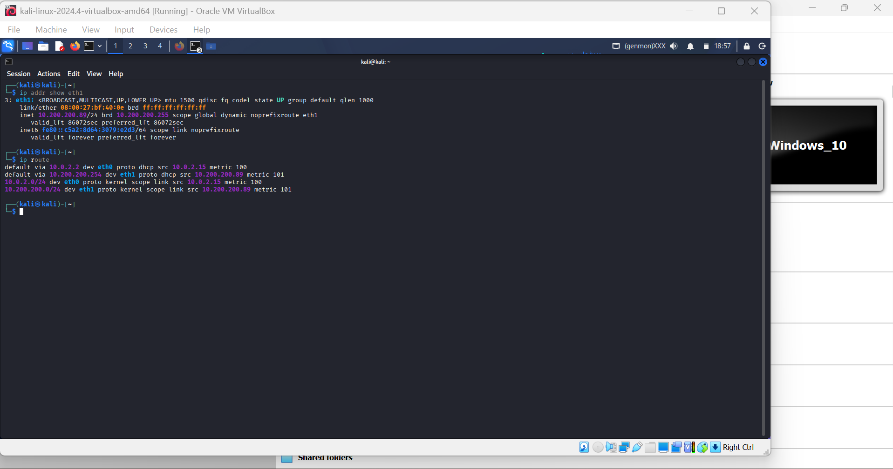
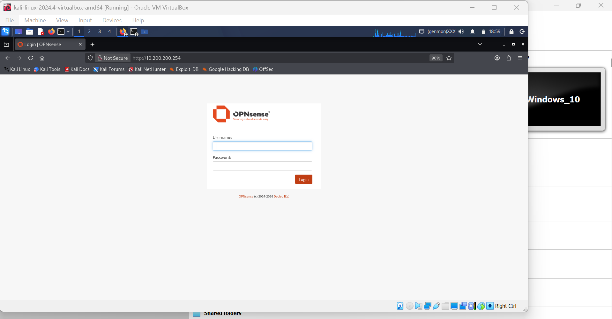
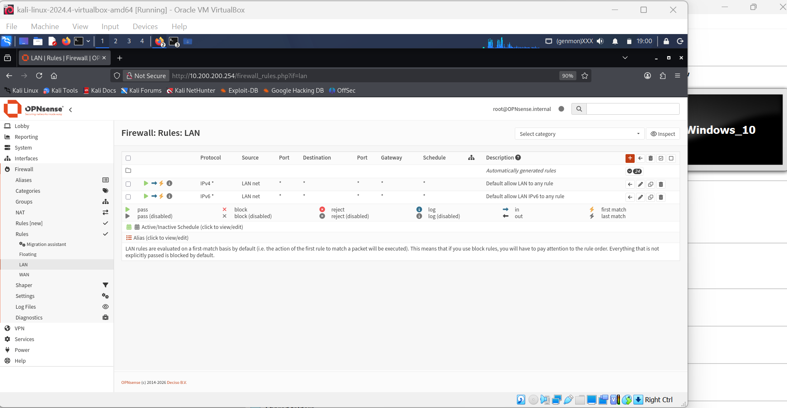

# Cybersecurity Network Security Lab — Kali Linux & OPNsense

## Overview

This project documents a hands-on cybersecurity lab environment built using Kali Linux, OPNsense, Windows, and VirtualBox.

The lab was created to develop practical experience with network segmentation, firewall configuration, network interfaces, IP addressing, and security-focused network troubleshooting.

## Lab Environment

- Kali Linux
- OPNsense
- Windows
- VirtualBox
- Internal virtual network

## Network Architecture

```text
                    VirtualBox Lab
                         │
                     OPNsense
                 ┌───────┴───────┐
                 │               │
              WAN (em0)       LAN (em1)
             10.0.2.x        10.200.200.254/24
                                 │
                              OPN-LAN
                         ┌───────┴───────┐
                         │               │
                       Kali           Windows
                  10.200.200.89     10.200.200.12

```
Lab Configuration

OPNsense

The firewall was configured with separate WAN and LAN interfaces.

* WAN: em0
* LAN: em1
* LAN IPv4: 10.200.200.254/24

Kali Linux

Kali Linux was connected to the internal OPN-LAN network.

* Interface: eth1
* IPv4: 10.200.200.89/24

Kali was also used to access the OPNsense web administration interface over the internal network.

Firewall Configuration

The OPNsense LAN firewall rules were reviewed as part of the lab to understand how traffic is controlled between the internal network and other network destinations.

Screenshots

### OPNsense Interface Assignments



### OPNsense LAN Configuration



### Kali Network Configuration



### Kali Accessing OPNsense



### OPNsense LAN Firewall Rules



Skills Practiced

* Virtual machine networking
* Network segmentation
* IPv4 addressing and subnetting
* Network interface configuration
* Firewall configuration
* OPNsense administration
* Kali Linux networking
* Network troubleshooting
* VirtualBox networking
* Basic security lab design

What I Learned

This lab helped me understand how virtual machines can be connected through isolated networks and how a firewall can control communication between network segments.

I gained practical experience configuring network interfaces, assigning IPv4 addresses, troubleshooting connectivity, and working with OPNsense firewall rules.

The lab also strengthened my understanding of how Kali Linux can be used within a controlled cybersecurity environment for network security learning and testing.

Career Development

This project supports my goal of developing stronger skills in cybersecurity and network engineering.

Working with OPNsense, Kali Linux, VirtualBox, and network segmentation has helped me build practical experience beyond theoretical coursework and strengthened my understanding of how secure network environments are designed, configured, and troubleshot.

